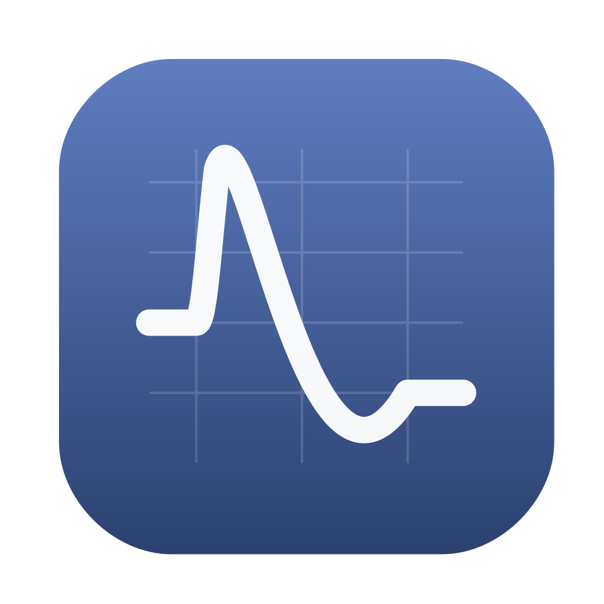

<div align="center">
  
</div>

# Labquake Explorer

A GUI application for analyzing and visualizing labquake event data.

## Installation

```bash
pip install -e .
```

## Usage

Run using the installed entry point:
```bash
labquake-explorer
```

Or run directly:
```bash
python -m labquake_explorer.main
```

## Features

- Load and analyze labquake data stored in NPZ and HDF5 formats
- Extract and process events
- Visualize data with interactive plots
- Process strain data
- Fit Cohesive Zone Model
